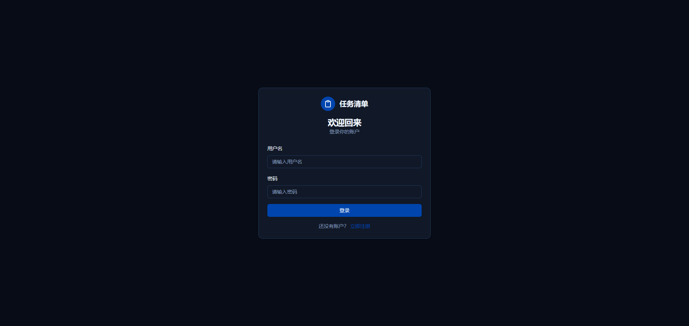
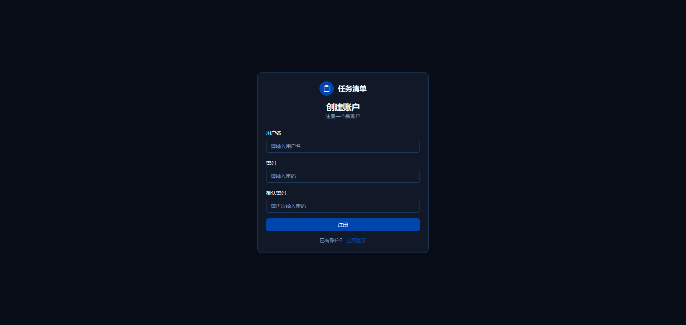
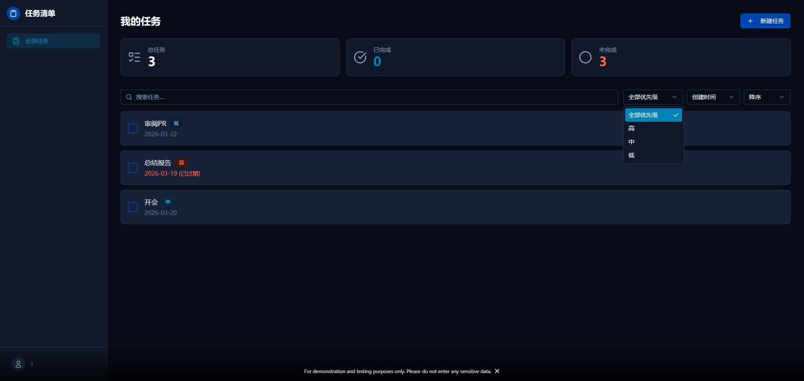
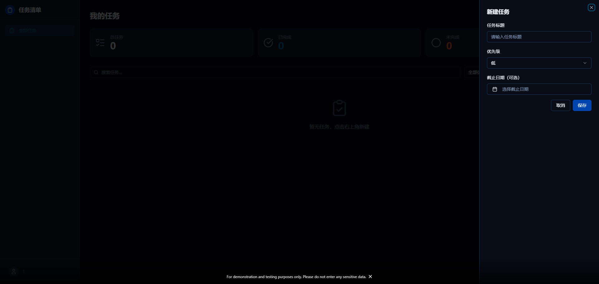

# Todo Frontend

现代化的任务管理应用，支持用户认证、任务 CRUD、筛选排序等功能。

## 在线演示

[https://todo-frontend.zh-cn.edgeone.cool/login](https://todo-frontend.zh-cn.edgeone.cool/login)

## 功能特性

- 用户注册与登录
- JWT Token 自动过期检查（30分钟）
- 任务创建、编辑、删除
- 任务完成状态切换（乐观更新）
- 任务优先级设置（低/中/高）
- 任务截止日期设置
- 过期任务高亮提醒
- 任务搜索（500ms 防抖）
- 按优先级筛选
- 多维度排序（创建时间/优先级/截止日期）
- 升降序切换
- 任务统计（总任务数/已完成/未完成）
- 流畅的动画效果（framer-motion）
- Toast 通知提示
- 响应式布局（移动端适配）

## 技术栈

### 前端

- React 19
- TypeScript 5.9
- Vite 8.0
- Tailwind CSS 3.4
- shadcn/ui (Radix UI)
- framer-motion
- react-router-dom 7
- axios
- date-fns
- Sonner

### 后端

- FastAPI
- PostgreSQL
- JWT 认证

## 本地运行

### 1. 克隆项目

```bash
git clone <repository-url>
cd todo-frontend
```

### 2. 安装依赖

```bash
npm install
```

### 3. 配置环境变量

在项目根目录创建 `.env` 文件：

```env
VITE_API_BASE_URL=https://your-backend-api.com
```

### 4. 启动开发服务器

```bash
npm run dev
```

访问 http://localhost:5173

## 项目截图






## 项目结构

```
todo-frontend/
├── src/
│   ├── components/ui/     # shadcn/ui 组件
│   ├── features/todos/    # 任务功能模块
│   ├── layouts/           # 页面布局
│   ├── pages/             # 页面组件
│   ├── routes/            # 路由配置
│   ├── services/          # API 服务
│   └── lib/               # 工具函数
├── package.json
├── tsconfig.json
├── vite.config.ts
└── tailwind.config.js
```

## 后端仓库

[https://](https://)
